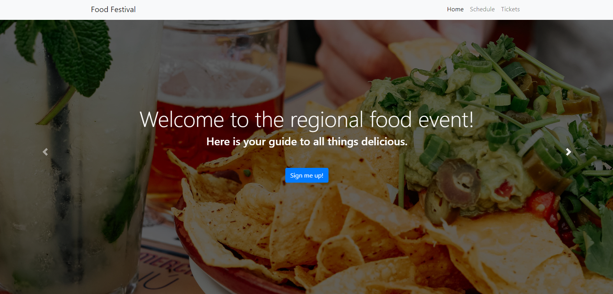

  # Food Festival (PWA)
  
  This web application uses webpack to optimize user experience using modularized code and cacheing to accommodate slow or absent network connectivity. This application has also been convered to a PWA and can be downloaded and accessed on mobile devices as if it were a native application.
  
  ## Table of Contents
  
  * [Installation](#installation)
  * [Built With](#built)
  * [Usage Information](#usage)
  * [Authors & Acknowledgements](#credits)
  * [Contact](#questions)
  
  
  ## Installation
  This application can be accessed at its deployed GitHub pages link.

  ## Built With
  * HTML
  * CSS
  * JavaScript
  * JQuery
  * Popper.js
  * Bootstrap
  * Webpack
  * Webpack Bundle Analyzer
  * Webpack CLI
  * Webpack Dev Server
  * Webpack PWA Manifest
  * Image Webpack Loader
  
  ## Usage Information
  [Food Festival](https://tovtc.github.io/food-festival-scscbc/) 
    
  This application is specific to the Food Festival event, including schedule, mailing, and ticketing. 
    
    
  
  ## Authors & Acknowledgements
  
  © 2020 - 2022 Trilogy Education Services, a 2U, Inc. brand. All Rights Reserved.
  
  Made by [TOVTC](https://github.com/TOVTC).
  
  ## Questions?
  Contact repository author via [GitHub](https://github.com/TOVTC). 
    
  
  